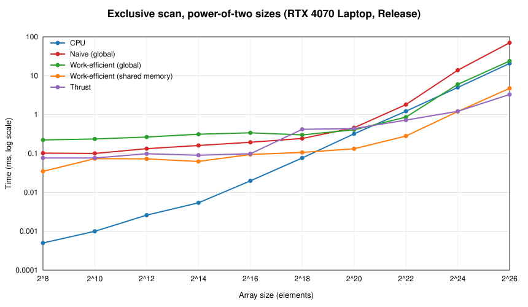

CUDA Stream Compaction
======================

**University of Pennsylvania, CIS 565: GPU Programming and Architecture, Project 2**

* Ximing Luo
  * [LinkedIn](https://www.linkedin.com/in/ximingluo), [personal website](https://ximingluo.com)
* Tested on: Windows 11 Home 10.0.26200, AMD Ryzen 9 8945HS @ 4.0GHz 32GB, NVIDIA GeForce RTX 4070 Laptop GPU 8GB (personal laptop), CUDA 13.3, Visual Studio 2022

## Overview

This project is about exclusive scan (prefix sum) and stream compaction on the GPU. Stream compaction here means taking an int array, throwing away every 0, and packing the survivors into a new array in their original order. The same idea will be used in the path tracer to drop terminated rays.

The CPU version was written first and serves as the reference for everything else, followed by three GPU scans, a GPU compaction, and the extra credit.

Features:

* CPU scan, compaction without scan, and compaction with scan (map, scan, scatter) in `cpu.cu`
* Naive GPU scan in global memory in `naive.cu`
* Work-efficient GPU scan and stream compaction in `efficient.cu`, with the map and scatter kernels in `common.cu`
* Thrust scan wrapper in `thrust.cu`
* Part 5 extra credit: the work-efficient scan only launches the threads that have work at each level
* Extra credit 1: radix sort in `radix.cu`
* Extra credit 2: two shared-memory scans in `shared.cu`, GPU Gems Example 39-1 (naive) and Example 39-2 (work-efficient with bank-conflict padding), both working on arrays of any length

## How each version works

**CPU.** `scan` is a single for loop with a running sum. `compactWithoutScan` is one loop with a write pointer. `compactWithScan` does the same three steps the GPU does: map to a 0/1 array, exclusive scan it, then scatter each nonzero element to its scanned index. The scan inside it is inlined instead of calling `scan()`, because the timer class throws if it is started twice.

**Naive scan.** This is the Hillis-Steele algorithm from GPU Gems 39.2.1 with plain global memory. One kernel does one level: every thread `k` writes `in[k - offset] + in[k]` if `k >= offset` and otherwise just copies `in[k]`. The host loops `offset = 1, 2, 4, ...` for `ilog2ceil(n)` launches and swaps two device buffers between launches, so no thread ever reads what another thread is writing. The algorithm produces an inclusive scan, so it is turned into an exclusive one on the copy back: `odata[0] = 0` and the device result lands in `odata + 1`. Nothing needs padding; the kernel just bounds-checks on `n`.

**Work-efficient scan.** Blelloch's up-sweep and down-sweep from 39.2.2, in place on one device buffer. The buffer is padded with zeros to the next power of two (`1 << ilog2ceil(n)`), which is what makes non-power-of-two sizes work. The up-sweep kernel at level `d` adds `x[k + 2^d - 1]` into `x[k + 2^(d+1) - 1]`, then the last element is zeroed with a memset, then the down-sweep kernel does the swap-and-add from the patched Figure 39-4. Those three steps live in an untimed helper `scanInPlace` so that `compact` and the radix sort can call it inside their own timers.

**Compaction.** `kernMapToBoolean`, a device-to-device copy of the flags into the padded scan buffer, `scanInPlace`, then `kernScatter`. The element count is `bools[n-1] + indices[n-1]`, read back with two 4-byte copies after the timer stops.

**Thrust.** The input goes into a `thrust::host_vector`, that gets copied into a `thrust::device_vector`, and a second `device_vector` holds the output. Only the `thrust::exclusive_scan` call is between the timer start and stop.

**Timing.** Every GPU function allocates and copies before `startGpuTimer()` and copies back and frees after `endGpuTimer()`, so the numbers below are the algorithm only. The CPU functions do the same with `new`/`delete` around the CPU timer. All measurements are Release builds run without the debugger, and each number is the best of three runs.

## Performance

### Block sizes

Each file has its own `blockSize` define. Block sizes from 64 through 1024 were swept at 2^24 elements. Times in ms:

| blockSize | Naive scan | Work-efficient scan | Shared-memory scan | Radix sort |
|---|---|---|---|---|
| 64   | 14.87 | 6.55 | 1.20 | 129.4 |
| 128  | 14.86 | 6.32 | 1.19 | 130.8 |
| 256  | 14.89 | 6.04 | 1.24 | 128.9 |
| 512  | 14.92 | 5.94 | 1.18 | 133.5 |
| 1024 | 13.89 | 6.08 | 1.36 | 131.3 |

The chosen values are naive 1024, work-efficient 128, radix 256, and shared-memory 128 (256 elements per block). The differences for the global-memory kernels are inside run-to-run noise, except naive at 1024, which was consistently about 7% better, probably because 24 launches of fewer, bigger blocks schedule faster. The fact that block size barely matters is already a hint that these kernels are waiting on memory, not on having enough threads in flight. The shared-memory scan is the one place it clearly matters: at 1024 threads per block only one block fits under an SM's 1536-thread limit, so occupancy drops and it slows down.

### Scan: CPU vs. naive vs. work-efficient vs. shared memory vs. Thrust



Power-of-two sizes, ms:

| n | CPU | Naive | Work-efficient | Shared-memory | Thrust |
|---|---|---|---|---|---|
| 2^16 | 0.020 | 0.194 | 0.340 | 0.094 | 0.098 |
| 2^20 | 0.321 | 0.459 | 0.407 | 0.132 | 0.436 |
| 2^24 | 4.99 | 13.9 | 6.00 | 1.20 | 1.22 |
| 2^26 | 20.7 | 70.3 | 23.9 | 4.75 | 3.29 |

The whole test program was also run at the non-power-of-two sizes from recitation (7, 13, 37, 123, 457, 1003) and at 2^20, 2^24, and 2^26, and every test passes at every size. One thing to know when reading the small-size numbers: the power-of-two test is the first call into each module, so it pays the one-time CUDA module load. The non-power-of-two run right after it is the honest number at small `n` (for example the shared-memory scan is 0.007 ms at 256 elements, not 0.05).

### What's going on

**Below roughly 2^18 elements nothing on the GPU beats the CPU.** The CPU loop is one pass over a few KB. The naive scan needs `log2 n` launches and the work-efficient one `2 log2 n` launches plus a memset, and each launch costs a few microseconds no matter how small the array is, so both sit at 0.1 to 0.4 ms while the CPU is at a few microseconds. That's pure launch overhead, not memory or compute.

**The naive scan is bound by memory bandwidth, and it moves far too much of it.** Every pass reads two ints and writes one for every element, so total traffic is O(n log n). At 2^26 that's 26 passes over a 256 MB array, around 20 GB, in 70 ms. That works out to more than the 256 GB/s this GPU's memory is rated for, so some of those reads must be L2 hits, but either way the naive scan is going as fast as its algorithm allows. It isn't compute; the kernel does one add.

**The work-efficient scan does O(n) work but its memory access pattern is bad.** At level `d` the active threads touch elements `2^(d+1)` apart. From the third level on, each thread pulls in a whole 32-byte sector to use 4 bytes of it, so effective bandwidth is a fraction of peak. On top of that it needs 52 dependent launches at 2^26, and the deep levels launch a handful of threads that can't hide any latency. The result is that it only ties the CPU at 2^24 and above. Bottleneck: memory, specifically uncoalesced access, plus launch count.

**Both global-memory scans hit an L2 cliff.** Going from 2^22 to 2^24 is 4x the data but 8x the time for both of them. The RTX 4070 laptop chip has 32 MB of L2. A 2^22-int array is 16 MB and stays in L2 across all the passes; a 2^24-int array is 64 MB and every pass goes out to DRAM.

**The shared-memory scan fixes the access pattern.** Each block loads 256 elements with a coalesced read, does the entire up-sweep and down-sweep in shared memory, and writes back with a coalesced store. Global traffic ends up around four accesses per element in seven launches total, and it runs at over 200 GB/s at 2^26. It is 5x faster than the global-memory version and matches Thrust at 2^24.

**Thrust wins at the top end.** Thrust's scan is CUB's single-pass decoupled look-back scan, which reads and writes each element exactly once, so it does even less traffic than the shared-memory version. That's why it pulls ahead at 2^26 (3.3 ms vs 4.7 ms). At 2^18 and 2^20 Thrust is oddly slower than the shared-memory scan and about level with the naive scan. The likely cause is the temporary storage CUB allocates for its look-back tile states, which happens inside the timed call.

**Thrust on the Nsight timeline.** The test program was profiled at 2^24 with Nsight Systems. The kernel-level trace did not record in that run, but Thrust's own NVTX ranges and the CUDA API summary were enough to see what it does. `thrust::exclusive_scan` shows up as a single CUB `DeviceScan` range of about 1.5 ms, which matches what the event timer measured. Around it, building the `device_vector`s from host memory shows up as `thrust::copy` ranges of 6 to 7 ms each, `uninitialized_fill_n` (zeroing the output vector) takes about 3 ms, and the copy back is another 6 ms. Across the whole program, `cudaMemcpy` was 155 ms of API time versus 16 ms for all 1760 kernel launches combined. So inside the Thrust wrapper the scan is the small part; allocation, fill, and the PCIe copies are most of the wall time, which is exactly why the assignment says to keep them out of the timer.

### Part 5: why the "efficient" scan was slow, and the fix

Written straight from the slides, the work-efficient scan launches `N` threads at every level and has each one check `k % 2^(d+1) == 0`. At level `d` only one thread in `2^(d+1)` passes that test. By the deep levels thousands of blocks are launched whose threads all exit immediately, and launch cost, block scheduling, and a modulo are paid for every one of them.

The submitted version launches `N >> (d+1)` threads per level and each thread computes its element as `k = tid << (d+1)`. Every launched thread does work, the grid halves each level, and there's no modulo. It's only index math. To measure the difference, the all-threads kernels were temporarily swapped back in:

| n | All N threads + modulo | Active threads only |
|---|---|---|
| 2^22 | 2.05 ms | 0.86 ms |
| 2^24 | 9.78 ms | 6.00 ms |
| 2^26 | 39.4 ms | 23.9 ms |

That's 1.6x at the large sizes and 2.4x at 2^22. It does not fix the strided access pattern, which is why the global-memory version still can't get much past the CPU; for that, shared memory is needed.

## Extra credit 1: radix sort

`StreamCompaction::Radix::sort(n, odata, idata)` is an LSB-first radix sort for non-negative ints built on the split operation from the lecture slides. It first scans the input on the host for the largest value to find how many bits it needs (15 for the test data, which is under 2^15). Then for each bit:

1. `kernMapBit` writes `b[i]` = that bit of `a[i]` and `e[i] = !b[i]`.
2. `scanInPlace` (the work-efficient scan) turns `e` into `f`, the destination of every false key.
3. `kernRadixScatter` computes `totalFalses = f[n-1] + e[n-1]` right in the kernel (`e[n-1]` is just `1 - b[n-1]`, so there's no host round trip), then writes each element to `b[i] ? i - f[i] + totalFalses : f[i]`.
4. The two buffers swap.

The scan buffer is padded to a power of two, and since the scan overwrites the padding, the tail is re-zeroed with a memset every pass.

It's called in `main.cpp` like this and compared against `std::sort` on the same input:

```cpp
StreamCompaction::Radix::sort(SIZE, c, a);
```

```
==== radix sort, power-of-two ====
   elapsed time: 2.09408ms    (CUDA Measured)
    [   7  19 177 244 251 303 474 498 706 798 814 897 1017 ... 32486 32523 ]
    passed
```

| n | CPU `std::sort` | GPU radix sort |
|---|---|---|
| 2^16 | 2.88 ms | 3.52 ms |
| 2^20 | 42.8 ms | 6.04 ms |
| 2^24 | 670 ms | 126 ms |
| 2^26 | 2661 ms | 502 ms |

Fifteen passes, each with a full scan of about 50 launches, puts a floor of around 2 ms on the sort no matter how small the input is, so it only beats `std::sort` past about 2^17. From there it scales much better and is 5x faster at 2^26. The bottleneck is the global-memory scan run 15 times (about 15 x 24 ms of the 502 ms); the random writes in the scatter are second. Limitations: keys have to be non-negative, and it would be several times faster again if each pass used the shared-memory scan instead.

## Extra credit 2: scan in shared memory

`StreamCompaction::Shared::scan(n, odata, idata)` is GPU Gems Example 39-2. Each block of 128 threads handles 256 elements:

* Every thread loads two elements into dynamic shared memory, writing 0 for anything past `n`. That's how arbitrary lengths are handled without a separate padding pass.
* The up-sweep and down-sweep run entirely in shared memory. Each shared-memory index is offset by `CONFLICT_FREE_OFFSET(i) = i >> 5` (32 banks on this GPU). Without this, the power-of-two strides of the tree put many threads on the same bank at the deep levels and the accesses serialize. The macro printed in the chapter is a known typo; the corrected form is used here.
* Thread 0 saves the block total to a block-sums array and zeroes the root before the down-sweep.
* On the host, if there was more than one block, the block-sums array is scanned with the same kernel (recursively until a single block is left) and `kernAddIncrements` adds each block's prefix to its elements, which is section 39.2.4. At 2^26 it recurses through 262144, 1024, 4, and 1 block sums. All the intermediate buffers are allocated before the timer starts.

`Shared::scanNaive` is Example 39-1 with the same wrapper: each block of 128 threads runs the double-buffered Hillis-Steele scan on 128 elements in shared memory, and the block sums go through the same recursion.

Performance is in the scan table above. Both shared-memory versions are 5x faster than the global-memory work-efficient scan at 2^24 and 2^26 and within 1% of Thrust at 2^24. Surprisingly, the naive and work-efficient shared-memory versions run in the same time (1.15 ms at 2^24, 4.7 ms at 2^26). Once the whole tree is in shared memory, the extra O(n log n) adds in the naive version are essentially free; the one coalesced global load and store per element is what sets the time. Shared memory use is small (about 1 KB per block), so it never limits occupancy; block size does, as the sweep showed.

## Tests

Besides the original tests, `main.cpp` has these additions:

* `shared memory scan` and `shared memory naive scan`, power-of-two and non-power-of-two, checked against the CPU scan.
* A radix sort section: `radix sort`, power-of-two and non-power-of-two, checked against `std::sort`, with `std::sort` timed by the CPU timer for the comparison.

## Build note

`stream_compaction/CMakeLists.txt` is modified beyond the source list. Besides adding `radix.cu/.h` and `shared.cu/.h`, it passes `-Xcompiler=/Zc:preprocessor` to nvcc when building with MSVC. Without this, CUDA 13.3's Thrust headers stop with an error about MSVC's traditional preprocessor. That was the one build problem encountered.

## Test program output

`SIZE = 1 << 8`:

```
****************
** SCAN TESTS **
****************
    [  47  44  25   0   1   8  35  39  33   9  33   7  38 ...  23   0 ]
==== cpu scan, power-of-two ====
   elapsed time: 0.0006ms    (std::chrono Measured)
    [   0  47  91 116 116 117 125 160 199 232 241 274 281 ... 6203 6226 ]
==== cpu scan, non-power-of-two ====
   elapsed time: 0.0001ms    (std::chrono Measured)
    [   0  47  91 116 116 117 125 160 199 232 241 274 281 ... 6164 6166 ]
    passed 
==== naive scan, power-of-two ====
   elapsed time: 0.110592ms    (CUDA Measured)
    passed 
==== naive scan, non-power-of-two ====
   elapsed time: 0.07168ms    (CUDA Measured)
    passed 
==== work-efficient scan, power-of-two ====
   elapsed time: 0.229376ms    (CUDA Measured)
    passed 
==== work-efficient scan, non-power-of-two ====
   elapsed time: 0.11776ms    (CUDA Measured)
    passed 
==== thrust scan, power-of-two ====
   elapsed time: 0.083968ms    (CUDA Measured)
    passed 
==== thrust scan, non-power-of-two ====
   elapsed time: 0.03072ms    (CUDA Measured)
    passed 
==== shared memory scan, power-of-two ====
   elapsed time: 0.057344ms    (CUDA Measured)
    passed 
==== shared memory scan, non-power-of-two ====
   elapsed time: 0.007168ms    (CUDA Measured)
    passed 
==== shared memory naive scan, power-of-two ====
   elapsed time: 0.0512ms    (CUDA Measured)
    passed 
==== shared memory naive scan, non-power-of-two ====
   elapsed time: 0.022528ms    (CUDA Measured)
    passed 

*****************************
** STREAM COMPACTION TESTS **
*****************************
    [   2   1   1   1   0   1   1   2   3   1   3   3   1 ...   1   0 ]
==== cpu compact without scan, power-of-two ====
   elapsed time: 0.0004ms    (std::chrono Measured)
    [   2   1   1   1   1   1   2   3   1   3   3   1   1 ...   1   1 ]
    passed 
==== cpu compact without scan, non-power-of-two ====
   elapsed time: 0.0002ms    (std::chrono Measured)
    [   2   1   1   1   1   1   2   3   1   3   3   1   1 ...   1   2 ]
    passed 
==== cpu compact with scan ====
   elapsed time: 0.0008ms    (std::chrono Measured)
    [   2   1   1   1   1   1   2   3   1   3   3   1   1 ...   1   1 ]
    passed 
==== work-efficient compact, power-of-two ====
   elapsed time: 0.180224ms    (CUDA Measured)
    passed 
==== work-efficient compact, non-power-of-two ====
   elapsed time: 0.187392ms    (CUDA Measured)
    passed 

**********************
** RADIX SORT TESTS **
**********************
    [ 5650 16793 1021 17245 12616 25685 4597 15662 17895 22661 30335 18051 5709 ... 20325 15111 ]
==== cpu std::sort, power-of-two ====
   elapsed time: 0.0054ms    (std::chrono Measured)
==== radix sort, power-of-two ====
   elapsed time: 2.09408ms    (CUDA Measured)
    [   7  19 177 244 251 303 474 498 706 798 814 897 1017 ... 32486 32523 ]
    passed 
==== cpu std::sort, non-power-of-two ====
   elapsed time: 0.0053ms    (std::chrono Measured)
==== radix sort, non-power-of-two ====
   elapsed time: 2.16781ms    (CUDA Measured)
    [   7  19 177 244 251 303 474 498 706 798 814 897 1017 ... 32486 32523 ]
    passed 
```
